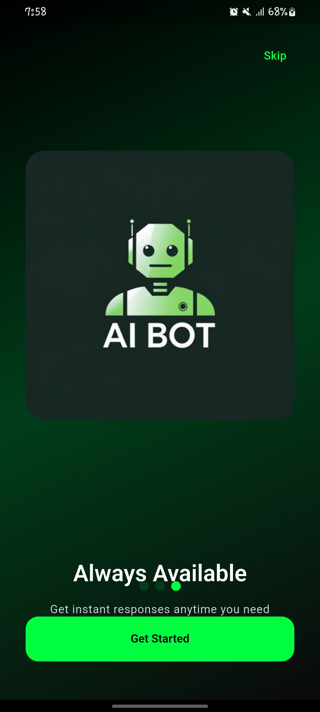

# Mira AI


# a simple ai chatbot app built with flutter and grok API

## Screenshots


<div style="display: flex; gap: 10px; flex-wrap: wrap;">
  
  
  
  
  
  
  
</div>

## License

This project is licensed under the MIT License — see the [LICENSE](./LICENSE) file for details.

Copyright (c) 2025 Mira-AI

*(Tap any image to enlarge)*

```bash
git clone https://github.com/Miftah-Fentaw/Mira-AI.git
cd mira-ai
flutter pub get
flutter run 


