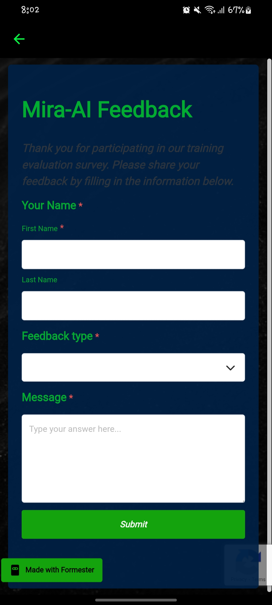

<p align="center">
  
</p>

# Mira AI — Your Intelligent Companion

Mira AI is a high-performance, sleek chatbot application built with **Flutter** and powered by the **Groq Llama 3** (via Groq API). It features a striking neon-on-black aesthetic and provides a seamless, lightning-fast conversational experience.

## ✨ Key Features

- 🧠 **Groq-Powered Intelligence**: Leveraging Llama 3 models for near-instant responses.
- 🕒 **Chat History**: Multiple persistent conversation threads, allowing you to pick up where you left off.
- 🎨 **Neon Design System**: A premium, high-contrast dark theme with vibrant neon green accents.
- 📱 **Responsive Interface**: Optimized for a smooth experience across various screen sizes.
- 🛡️ **Session Management**: Easily create, switch between, and delete chat sessions.
- 📝 **Feedback System**: Integrated feedback form to help improve the AI experience.

## 🛠️ Tech Stack

- **Framework**: [Flutter](https://flutter.dev) (v3.6.0+)
- **State Management**: [Riverpod](https://riverpod.dev)
- **API Connectivity**: [Groq Cloud API](https://console.groq.com)
- **Local Persistence**: [SharedPreferences](https://pub.dev/packages/shared_preferences)
- **Navigation**: [GoRouter](https://pub.dev/packages/go_router) / Navigator
- **Networking**: [http](https://pub.dev/packages/http)

## 📸 Screenshots

<table align="center">
  <tr>
    <td><br/><sub>Onboarding</sub></td>
    <td><br/><sub>Welcome</sub></td>
    <td><br/><sub>Chat Intro</sub></td>
  </tr>
  <tr>
    <td><br/><sub>Conversation</sub></td>
    <td><br/><sub>History Drawer</sub></td>
    <td><br/><sub>Feedback Form</sub></td>
  </tr>
</table>

## 🚀 Getting Started

### Prerequisites

- Flutter SDK installed on your machine.
- A Groq API Key (Get one for free at [console.groq.com](https://console.groq.com/keys)).

### Installation

1. **Clone the repository:**
   ```bash
   git clone https://github.com/Miftah-Fentaw/Mira-AI.git
   cd Mira-AI
   ```

2. **Install dependencies:**
   ```bash
   flutter pub get
   ```

3. **API Key Setup:**
   For security, the API key file is gitignored. You need to create it manually:
   - Create a file at `lib/apikey.dart`.
   - Add the following content:
     ```dart
     const String apikey = 'YOUR_GROQ_API_KEY_HERE';
     const String formkey = 'YOUR_FORMESTER_URL_HERE';
     ```

4. **Run the app:**
   ```bash
   flutter run
   ```

## 📄 License

This project is licensed under the MIT License — see the [LICENSE](./LICENSE) file for details.

---
<p align="center">Made with 💚 by Mira AI Team</p>
