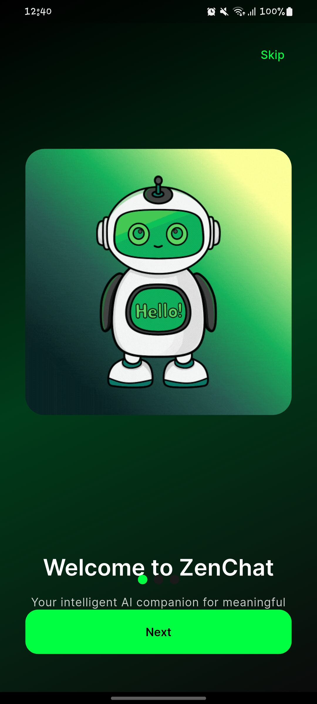
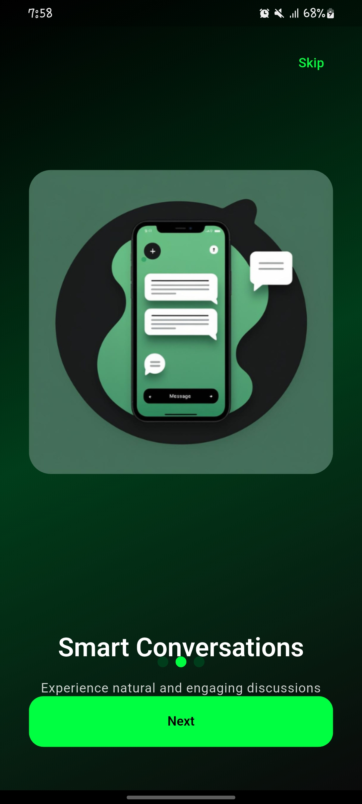
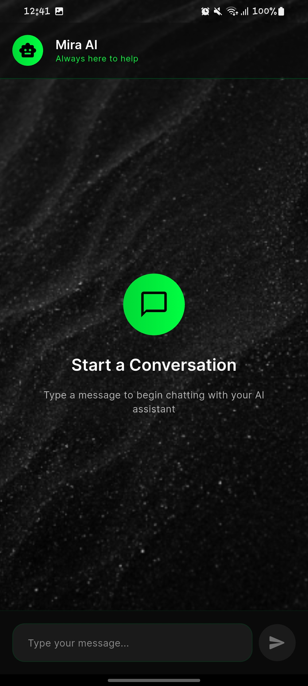
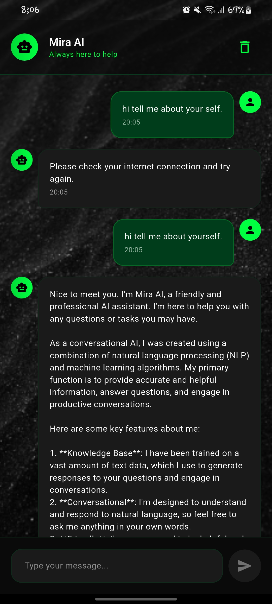
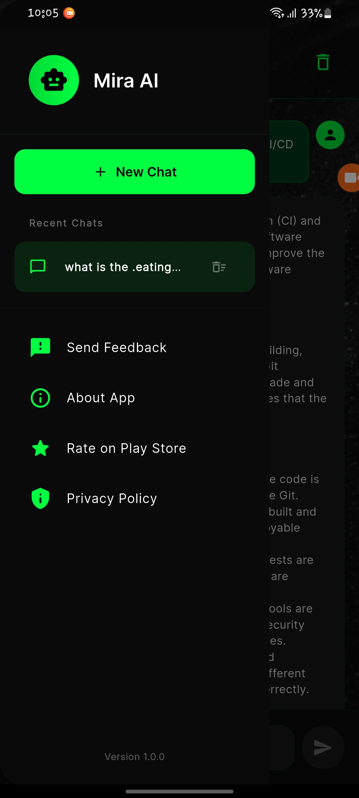

# Mira AI

# description

- a simple ai chatbot app built with flutter and grok API

## Screenshots

{ width=50 }
{ width=50 }
{ width=50 }  { width=50 } { width=50 }

*(Tap any image to enlarge)*

```bash
git clone https://github.com/Miftah-Fentaw/Mira-AI.git
cd mira-ai
flutter pub get
flutter run 
# Mira-AI

